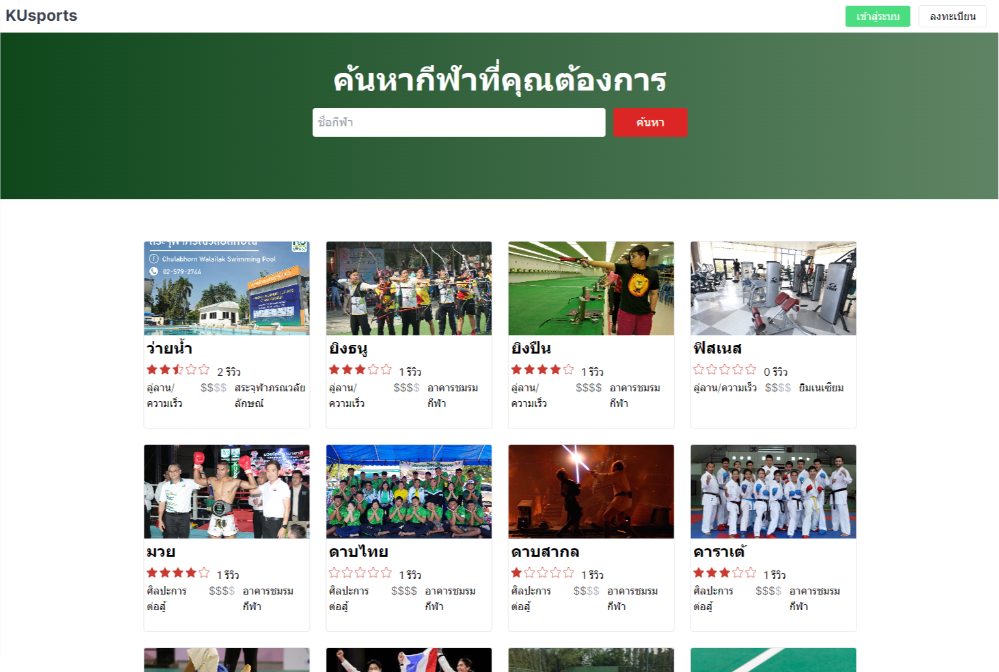

# KU sport

This is a example project for KU sport booking system.

## Getting Started

First, setting .env file and run the development server:

```bash
npm install
cp .env.example .env
npx prisma db push
npm run dev
```
fianlly, open [http://localhost:3000/api/seed](http://localhost:3000/api/seed) to seed data.

then open [http://localhost:3000](http://localhost:3000) with your browser to see the result.

#
You can start editing the page by modifying `app/page.tsx`. The page auto-updates as you edit the file.

This project uses [`next/font`](https://nextjs.org/docs/basic-features/font-optimization) to automatically optimize and load Inter, a custom Google Font.

## Tech stack
- [Next.js](https://nextjs.org/)
- [Prisma](https://www.prisma.io/)
- [Tailwind CSS](https://tailwindcss.com/)
- [PostgreSQL](https://www.postgresql.org/)
- [TypeScript](https://www.typescriptlang.org/)

## Deploy on Vercel

The easiest way to deploy your Next.js app is to use the [Vercel Platform](https://vercel.com/new?utm_medium=default-template&filter=next.js&utm_source=create-next-app&utm_campaign=create-next-app-readme) from the creators of Next.js.

Check out our [Next.js deployment documentation](https://nextjs.org/docs/deployment) for more details.
